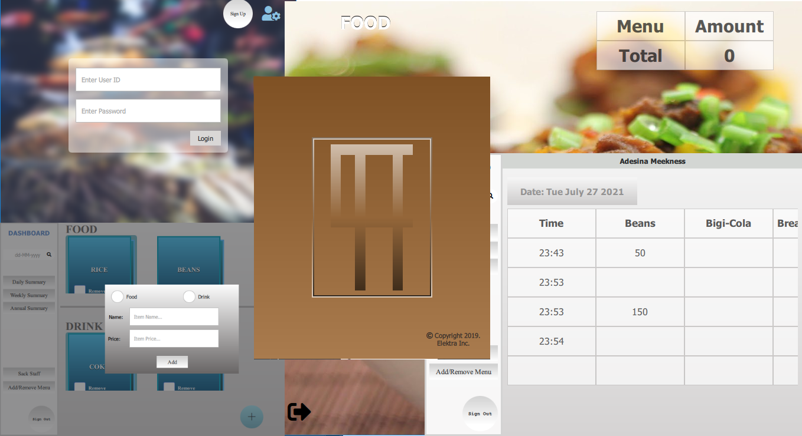

<h1 align="center" style="color: #007fc4;">CAFE APP</h1>

    

    <i>The Cafe App is a system software for managing the sales of food and drinks in resturants.</i>

## Features ##

* An lightweight admin panel
* A simple staff view
* Simplicity
* A native RSA based encryption algorithm

## Installation ##

On your windows pc, run the CafeAppInstaller.exe
